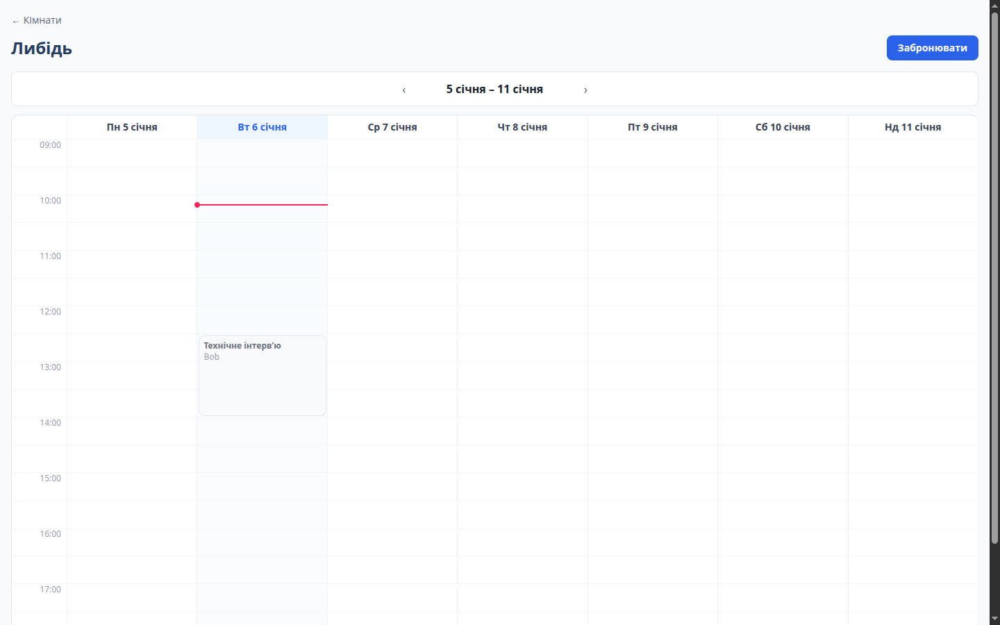

# Meeting Room Booking App

Meeting room booking service. Built for the [UA-SKILLS](https://ua-skills.com/) coding contest for junior developers.

[Читати українською](README.uk.md)

  
   
  Full jury review, 5-page PDF, opens on click

## Result

| Spec category | Weight | Score |
| --- | :---: | :---: |
| Functionality | 40 | 38.67 |
| Code and architecture | 25 | 23 |
| UI/UX | 20 | 14.67 |
| README and dev history | 15 | 12 |
| Checklist total | 100 | 88.34 |
| Final public score (with bonuses) | | **100 / 100** |

### What the jury wrote

> The work was done at a solid level, especially in protecting against race conditions during booking and handling time zones - both usually trip up projects like this, and here they're handled down to the small edge cases.

What worked:
- 15 concurrent requests for the same slot produced exactly one booking in the database. Checked both in the service and in Postgres via `EXCLUDE USING gist`.
- Time rules run on `Europe/Kyiv` through luxon, recurring series don't drift after the daylight saving switch, and the UI shows time in the viewer's own zone.
- Passwords hashed with argon2, sessions stored in the database with a TTL, cookie is httpOnly and secure. A dummy hash for nonexistent emails prevents telling registered addresses apart by response time.
- No 500 on any malformed API request the jury tried, one error format across the whole backend.
- On mobile (390px) the grid switches to a single-day view.

Needs work:
- `weekStart` is only checked with a regex, so an invalid date can trigger a 500.
- Booking blocks in the grid don't work with a keyboard.
- The session cookie has no `Max-Age`, and `WEB_ORIGIN` isn't passed to `docker-compose.yml`.
- Booking logic is split between `RoomsService` and `BookingService`.

## Screenshots

Taken by the jury during review.

| Week grid | Grid in Berlin time |
| --- | --- |
|  |  |
| **Cancellation** | **Booking ending soon notice** |
|  |  |

| Mobile grid | Form | My bookings |
| :---: | :---: | :---: |
|  |  |  |

More screenshots in [`docs/shots`](docs/shots).

---

### Running with docker

docker compose up --build
frontend http://localhost:5173
API http://localhost:3000/api

Migrations and seed run automatically.

Seed accounts
alice@example.com password123
bob@example.com password123

**Running locally:**
cp .env.example .env
npm install
docker compose up -d postgres
npm run migrate -w server
npm run seed -w server
npm run dev

### Bonus features implemented

1. Docker compose in one command
2. Race condition protection - exclusion constraint in Postgres
3. Email confirmation in dev mode
4. Weekly recurring bookings - cancel one occurrence or the whole series
5. Notice N minutes before a booking ends if the next slot is taken
6. API integration tests - server/test/booking.e2e-spec.ts
7. Room filter by capacity
8. Responsive layout for mobile devices

### How overlap checking works

A booking is essentially a time interval.
Two intervals overlap if each starts before the other one ends:
aStart < bEnd && bStart < aEnd

The booking end is excluded from the check, [start, end),
so 11:00-12:00 and 12:00-13:00 don't conflict.

**Checked twice:**

**In the service, rooms.service.ts, method isSlotTaken**
I pull all non-cancelled bookings for that room on that day from the database, then check overlaps with the `intervalsOverlap` function using the formula above. If they overlap, I return 409 "this time is already booked."
(A single day is enough since bookings only run 09:00-19:00 and never cross midnight.)
If the user is booking a series, I add the date to the error message.

**In the database, migration add_booking_exclusion_constraint**

    EXCLUDE USING gist (
      room_id WITH =,
      tstzrange(start_at, end_at, '[)') WITH &&
    ) WHERE (cancelled_at IS NULL)

This blocks two rows where the room matches and the time ranges overlap. Cancelled bookings don't count.
tstzrange is a timestamptz range.

When two people click book at the same moment, both pass the check in the code and the database is still empty at that point. Only one insert succeeds; Postgres returns error 23P01 to the other, which I catch and turn into a normal 409.

For a series, I first check every occurrence, then insert them all in one transaction: either the whole series is inserted, or none of it.

### How time is stored

Time is stored as timestamptz; Postgres keeps an absolute UTC moment.
The API also works in UTC, ISO format.

Luxon parses the input in the browser's own zone and converts it to UTC before sending:
DateTime.fromISO(`${date}T${startTime}`).toUTC().toISO()

A user in Berlin (UTC+2) enters 10:00, the server receives 08:00Z, which is 11:00 in Kyiv.
That's why the form has a note about Kyiv time.

Booking rules (office opening and closing hours, the day boundaries used for overlap checks, the week boundaries for the grid, and the 30-minute increment) are all computed by the server in Europe/Kyiv. The zone is set in code; the server's own local time zone has no effect on any of this.

Recurring bookings are added as `plus({ weeks: 1 })` in Kyiv time, not as 7 days. After the daylight saving switch, a booking stays at the same Kyiv hour.

Time is displayed in the viewer's own zone: the grid labels and My Bookings render in the browser's zone. The grid itself is still built from Kyiv slots, so bookings land in the correct rows.

## Tests

Unit tests for interval overlap, no database needed:

    npm test

API integration tests (registration, booking, cancellation, validation errors) need a `.env` file and Postgres running with migrations applied:

    docker compose up -d postgres
    npm run migrate -w server
    npm run test:e2e -w server
