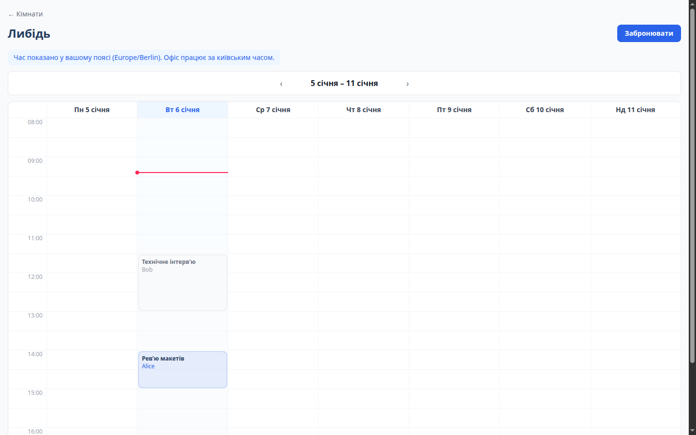
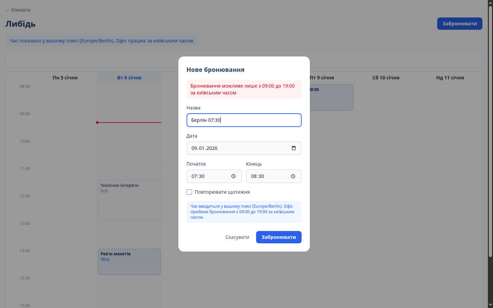
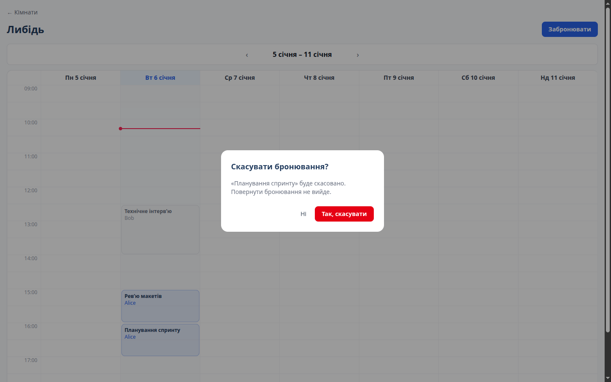
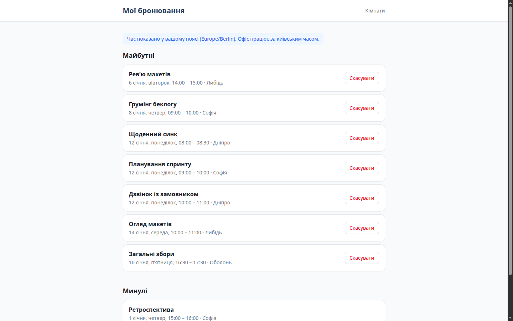
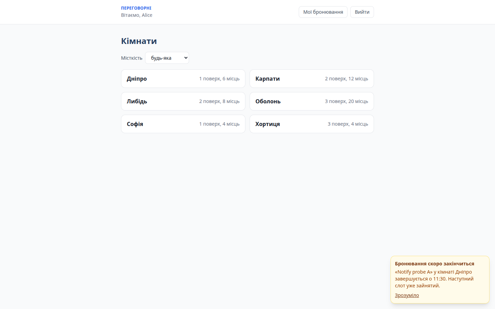
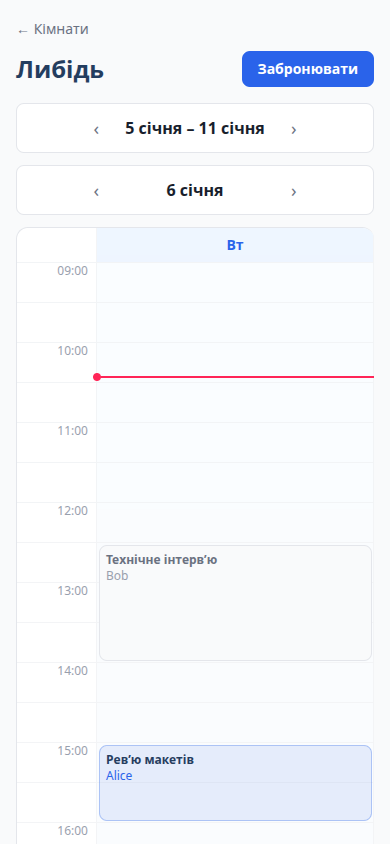
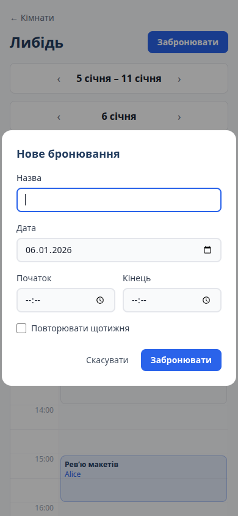
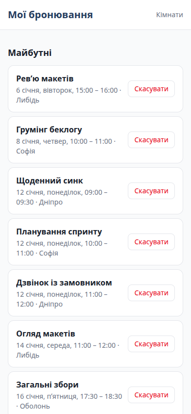
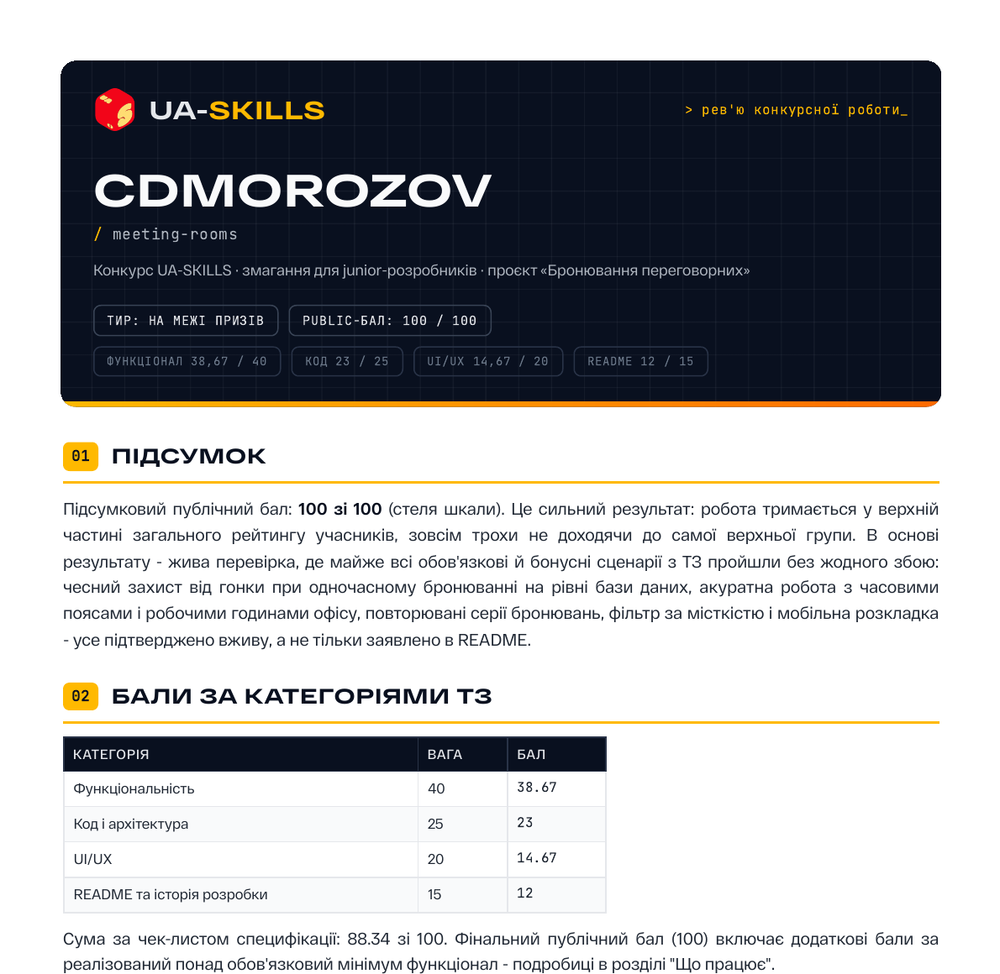

<h1>🗓️ Meeting Room Booking App</h1>

Сервіс бронювання переговорних: тижнева сітка, щотижневі серії і захист від подвійних броней. 
Робив його на конкурс <a href="https://ua-skills.com/"><b>UA-SKILLS</b></a> для junior-розробників.

<a href="#-скриншоти">Скриншоти</a> ·
<a href="#-результат-конкурсу">Результат</a> ·
<a href="#-запуск-через-docker">Запуск</a> ·
<a href="docs/uaskills-review.pdf">Рев'ю журі (PDF)</a>

## 📸 Скриншоти

Тижнева сітка кімнати. Час показано в поясі користувача, офіс працює за Києвом

<table>
  <tr>
    <td width="50%" align="center">
      
       Нове бронювання поза робочими годинами
    </td>
    <td width="50%" align="center">
      
       Підтвердження скасування
    </td>
  </tr>
  <tr>
    <td width="50%" align="center">
      
       Мої бронювання
    </td>
    <td width="50%" align="center">
      
       Сповіщення, що бронь скоро закінчиться
    </td>
  </tr>
</table>

<table>
  <tr>
    <td align="center">
      
       Сітка на телефоні
    </td>
    <td align="center">
      
       Форма
    </td>
    <td align="center">
      
       Мої бронювання
    </td>
  </tr>
</table>

Скриншоти зробило журі під час перевірки. Решта лежить у [`docs/shots`](docs/shots).

## 🏆 Результат конкурсу

| Категорія ТЗ | Вага | Бал |
| --- | :---: | :---: |
| ⚙️ Функціональність | 40 | 38.67 |
| 🧱 Код і архітектура | 25 | 23 |
| 🎨 UI/UX | 20 | 14.67 |
| 📝 README та історія розробки | 15 | 12 |
| Сума за чек-листом | 100 | 88.34 |
| 🏆 Фінальний public-бал (з бонусами) | | **100 / 100** |

  
   
  📄 Повне рев'ю журі в PDF на 5 сторінок, відкривається по кліку на картинку

### 💬 Що написало журі

> Робота зроблена на впевненому рівні, особливо в частині захисту від гонки при бронюванні і роботи з часовими поясами - обидві теми зазвичай і підводять подібні проекти, а тут витримані до дрібних граничних випадків.

#### ✅ Що сподобалось

- 15 одночасних запитів на один слот дали рівно одну бронь у базі. Перевірка є і в сервісі, і в Postgres через `EXCLUDE USING gist`.
- Правила часу рахуються в `Europe/Kyiv` через luxon, серії не з'їжджають після переходу на літній час, а в інтерфейсі час показується в поясі користувача.
- Паролі в argon2, сесії лежать у базі з TTL, кука httpOnly і secure. Для неіснуючих email є фіктивний хеш, щоб за часом відповіді не можна було зрозуміти, чи зареєстрована адреса.
- На кривих запитах до API журі жодного разу не отримало 500, формат помилок один на весь бекенд.
- На телефоні (390px) сітка переходить у вигляд одного дня.

#### 🛠️ Зауваження

- `weekStart` перевіряється тільки регуляркою, тому неіснуюча дата може дати 500.
- Блоки броней у сітці не працюють з клавіатури.
- У сесійної куки немає `Max-Age`, а `WEB_ORIGIN` не передається в `docker-compose.yml`.
- Логіка бронювань розкидана між `RoomsService` і `BookingService`.

---

### 🐳 Запуск через docker
docker compose up --build  
фронт http://localhost:5173  
API http://localhost:3000/api  

міграції та сід запускаються автоматично

Облікові записи з сіда  
alice@example.com password123  
bob@example.com password123  

**Запуск локально:**  
cp .env.example .env  
npm install  
docker compose up -d postgres  
npm run migrate -w server  
npm run seed -w server  
npm run dev  

### ✨ Реалізовані бонуси

1. Docker compose однією командою  
2. Захист від гонки - exclusion constraint в Postgres  
3. Підтвердження email в dev режимі  
4. Щотижневі повторюванні бронювання - з відміной одного повторення чи всієї серії  
5. Сповіщення про кінец бронювання за N хвилин якщо наступний слот зайнятий  
6. Інтеграційні тести API - server/test/booking.e2e-spec.ts  
7. фільтр кімнат по місткості
8. Адаптивність під мобільні пристрої  

### 🔒 Як влаштована перевірка перетинів

Одна бронь це по суті відрізок часу  
Два відрізки часу перетинаються якщо кожен починається раніше ніж закінчується інший   
aStart < bEnd && bStart < aEnd

Кінець бронювання при перевірці не включається [start, end)  
тому 11:00-12:00 та 12:00-13:00 не конфліктують

**перевіряю двічі**  

**Перевірка в сервісі rooms.service.ts метод isSlotTaken**
я достаю з бд усі невідмінені броні цієї кімнати на цей день, та за допомгою функції intervalsOverlap перевіряю перетини броней по формулі. Якщо перетинаються то видаю 409 "цей час вже зайнято".  
(одного дня вистачає бо броні тільки з 09:00 до 19:00, через опівніч не переходять).
Якщо у користувача серія броней то до тексту помилки додаю дату

**Перевірка в БД міграція add_booking_exclusion_constraint**

    EXCLUDE USING gist (
      room_id WITH =,
      tstzrange(start_at, end_at, '[)') WITH &&
    ) WHERE (cancelled_at IS NULL)

забороняємо дві строки де кімната однакова та відрізки часу перетинаються. скасовані не рахуться.
tstzrange - діапазон timestamptz

коли двоє тиснуть забронювати одночасно то перевірку в коді пройдуть обидва а в бд буде пусто.  
далі вставку зробить тільки один, другому postgres поверне помилку 23P01 я її ловлю та віддаю звичайну 409.

для серії спочатку перевіряю всі повторення, потім вставляю все однією
транзакцією. або вставляється вся серія, або нічого

### 🕐 Як зберігається час

Час зберігається як timestamptz, постгрес тримає абсолютний момент в utc  
по API теж ходить UTC в форматі ISO

луксон парсить введене в поясі браузера і переводить в UTC перед відправкою  
DateTime.fromISO(`${date}T${startTime}`).toUTC().toISO()

користувач з Берліна де utc+2 вводить 10:00 , на сервер йде 08:00Z, в києві це 11:00  
тому в формі є підказка про київський час

правила бронювання (коли початок та кінець роботи, границі доби при пошуку перетинів, та межі тижня для сітки, кратність 30 хвилинам) сервер рахує в europe/kyiv.  
Зона задана в коді, таймзона сервера ні на що не впливає

повторення додаю як plus({ weeks: 1 }) в київському поясі, а не 7 діб  
Після переходу на літній час бронювання залишається на тій самій годині по Києву

Показую в поясі користувача, підписи сітки і мої бронювання рендеряться в зоні браузера.  
Сітку при цьому будую по київських слотах, щоб броні стояли в правильних рядках.

## 🧪 Тести

юніт-тести на перетини інтервалів, база не потрібна

    npm test

інтеграційні тести API (реєстрація, бронювання, скасування, помилки валідації)
потрібні .env та піднятий postgres з застосованими міграціями

    docker compose up -d postgres
    npm run migrate -w server
    npm run test:e2e -w server